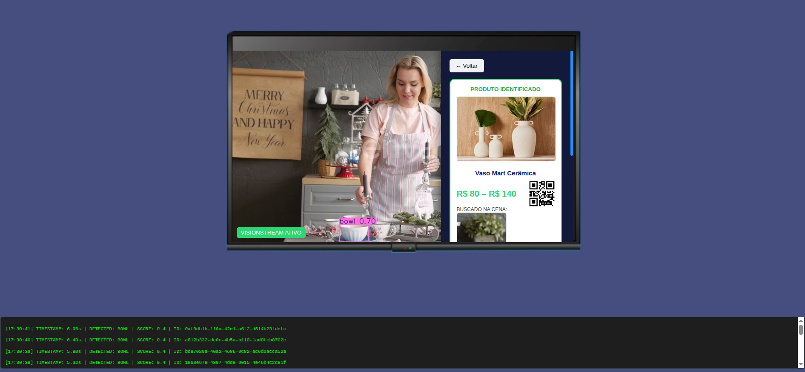

# VisionStream TV 3.0: T-Commerce Inteligente com IA



<!-- Descrição breve do projeto -->
Este projeto é uma prova de conceito desenvolvida para a disciplina **DCC102-2025.3-A - Seminário em Computação VI** (Sistemas Multimídia / Depto. de Ciência da Computação - UFJF).  
Ele demonstra a integração de técnicas de Inteligência Artificial em especial **Visão Computacional** com o ecossistema da TV 3.0, permitindo a **identificação de objetos em tempo real** e a oferta de produtos via interatividade (T-Commerce).

---

## Contexto e Arquitetura

<!-- Explica o contexto técnico do projeto -->
A **TV 3.0 (NextGen TV)** marca a transição da radiodifusão para um ambiente baseado em IP (Internet Protocol). Diferente da TV Digital tradicional, ela permite a convergência entre o sinal de Broadcast (ar) e Broadband (internet).

Nesta aplicação, o **servidor Flask** atua como um **nó de processamento de borda (Edge Computing)**, recebendo o fluxo de vídeo, processando metadados via IA e sincronizando com a interface do usuário (UI).

### Por que o vídeo é entregue via Stream de Imagens (MJPEG)?

- **Processamento Atômico:** A IA (YOLO) analisa frame a frame. Ao reenviar os frames processados, garantimos que o usuário veja exatamente o que a IA analisou.
- **Sincronismo de Metadados:** Evita buffering do player nativo do navegador, garantindo que QR Codes e informações do produto correspondam exatamente ao objeto na tela.
- **Baixa Latência:** O protocolo MJPEG oferece entrega quase instantânea após o processamento, simulando a agilidade necessária para gatilhos de compra em tempo real.

**Nota sobre áudio:** Por se tratar de fluxo focado em visão computacional, o áudio é tratado separadamente e não é o foco desta demonstração.

---

## Inteligência Artificial e Match de Imagens

<!-- Explica a lógica do backend de IA -->
A aplicação utiliza uma abordagem de duas camadas:

1. **Detecção (YOLOv8):** Identifica a classe do objeto (ex: caneca, garrafa) e suas coordenadas na cena.
2. **Identificação (Image Match):** Compara o recorte da TV com imagens do catálogo de produtos usando Histogramas HSV e Descritores ORB, simulando o "Melhor Match" comercial.

---

## Tecnologias Utilizadas

<!-- Lista de tecnologias e ferramentas do projeto -->
- **Backend:** Python 3.9 / Flask (Middleware da TV 3.0)
- **IA:** YOLOv8 (Ultralytics) / OpenCV (Processamento de frames)
- **Frontend:** HTML5 / CSS3 / JavaScript (Aplicação Interativa / DTVi)
- **Comunicação:** JSON (Metadados de aplicação)

---

## Estrutura do projeto
```
.
├── app.py              # Servidor Flask principal
├── products_catalog.json  # Catálogo de produtos
├── templates/
│   └── index.html      # Interface do usuário
├── static/
│   ├── css/            # CSS do mockup e sidebar
│   ├── js/             # JS do VisionStream
│   └── video/          # Vídeos de teste
└── environment.yml     # Dependências Conda

```


## 🚀 Como Executar

<!-- Instruções passo a passo para rodar o projeto -->
1. **Criar o ambiente Conda:**
```
conda env create -f environment.yml
conda activate vision_stream
```
2. **Iniciar o Servidor Flask:**

```
python app.py
```

3. **Acessar a interface no navegador:**
```
http://localhost:5000
```

## Demonstração em Tempo Real (Webcam)

Embora o projeto venha configurado para processar um **sinal de vídeo estático** (simulando o broadcast), a arquitetura permite o teste com captura **ao vivo**.  
Isso demonstra a capacidade da aplicação de atuar como um **Receptor de TV 3.0 em tempo real**.

### Como alternar para a webcam

No arquivo `app.py`, localize o método `gen_frames()` e altere a linha de captura de vídeo:

```python
# Antes (vídeo de teste)
cap = cv2.VideoCapture("stream/video_example.mp4")

# Depois (captura da webcam padrão)
cap = cv2.VideoCapture(0)
```

